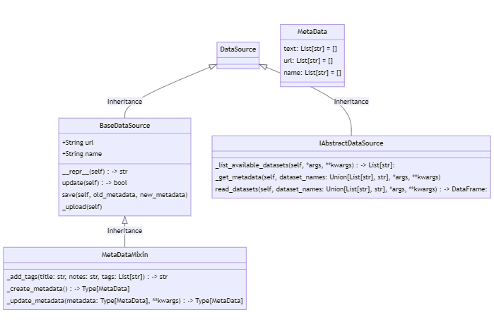

# Welcome to OpenDataLLm

OpenDataLLM is a project to increase accessibility of Italian public datasets. Interact with thousands of datasets with natural language

### Backend Logic:



### Start the application

#### Requirements
- python >= 3.9
- node.js

#### Configuration
- Create a .env file in the root directory and add your openai key
- Create a virtualenv and install the requirements.txt file

to start the backend run from the api directory:
```python
python main.py
```
to start the frontend run from the frontend directory:
```node.js
npm start
```
